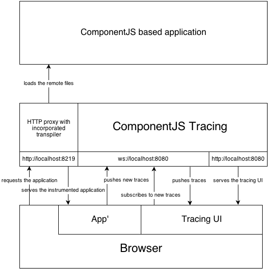

#ComponentJS Tracing Monitor

Tracing Monitor proxy for ComponentJS development support

##Overview

This is a [Node.js](http://nodejs.org/) based reverse proxy
to support development with [ComponentJS](http://componentjs.com/),
a powerful Component System for hierarchically structuring the
User-Interface dialogs of complex HTML5-based Rich Clients
([SPA](http://en.wikipedia.org/wiki/Single-page_application)s).

##Architecture
The diagram below illustrates the underlying architecture of the tracing
proxy application.

**Documentation:**
* [User Interface](app/ui#user-interface-spa)
* [Server Module](app/sv#websocket-server-module)
* [Plug-ins](app/sv/proxy.d/plugins#componentjs-plug-ins)
* [Transpiler](app/sv/proxy.d/transpiler#transpiler)

##Installation

###Prerequisites

* [Node.js](http://nodejs.org/)
* [NPM](https://npmjs.org/)
* Obtain a copy of this repository either by downloading the zip
file or cloning via [git](http://git-scm.com/)

###Installing dependencies

Executing the package file will install or update the necessary node modules.
* **Windows:** package.bat
* **Linux/Cygwin:** package.sh

##Usage

###Basic Usage

	node server.js

###Advanced Usage

	node server.js [options] [arguments]
The following options can either be supplied via the included [server.ini](server.ini) file or the
command line.  
*Note: Options need to be prefixed with two dashes*

* **version:** Print tool version and exit
* **help, h:** Print this help and exit
* **addr, a:** IP address to listen
* **port, p:** TCP port to listen
* **backlog, b:** TCP socket connection backlog
* **componentjs, cjs:** Regex matching the url of the ComponentJS file
* **components, cmps:** Regex matching the urls of the components files of the SPA
* **proxyaddr, A:** IP address to bind to
* **proxyport, P:** TCP port to listen in on
* **latestcjs, lcjs:** Overwrites applications ComponentJS file with the supplied version
* **proxyfwd, F:** Host and port of forwarding proxy (eg when you are behind a corporate proxy)
* **config=&lt;cfg&gt;:** Adds the specified section of the ini file to overwrite defaults

##Building the PEG grammar
If you want to make any changes to the PEG grammar that is used to parse the constraints, then you
first have to have a look at the [grammar.peg](app/ui/app/lib-grammar.peg). After having changed the file as desired,
run the grunt task *grammar* by simply executing this line in your bash/cmd/cygwin.

	grunt grammar

##Limitations

The ComponentJS Tracing Monitor can only be used with [Google Chrome](http://www.google.com/chrome/).
Why do we have this limitation? Because we use Chrome specific functionalities:

* Inspecting the stacktrace is necessary for the [tracing plug-in](app/sv/proxy.d/plugins#componentjs-plug-ins)
* CSS dimension calculation using the [calc](http://caniuse.com/calc) method
* Native Websockets since we don't want to provide any ugly Flash fallbacks
* HTML5 FileReader API

##License

Copyright (c) 2013 Ralf S. Engelschall (http://engelschall.com)

This Source Code Form is subject to the terms of the Mozilla Public
License, v. 2.0. If a [copy](LICENSE) of the MPL was not distributed with this file.
You can obtain one at http://mozilla.org/MPL/2.0/.

##Authors

- Ralf S. Engelschall (rse@engelschall.com)
- Christian Vaas (christianvaas@auspex.eu)
